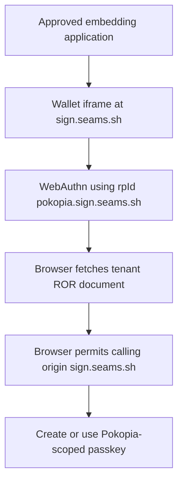
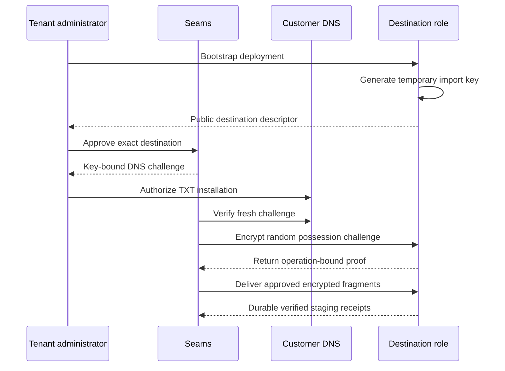
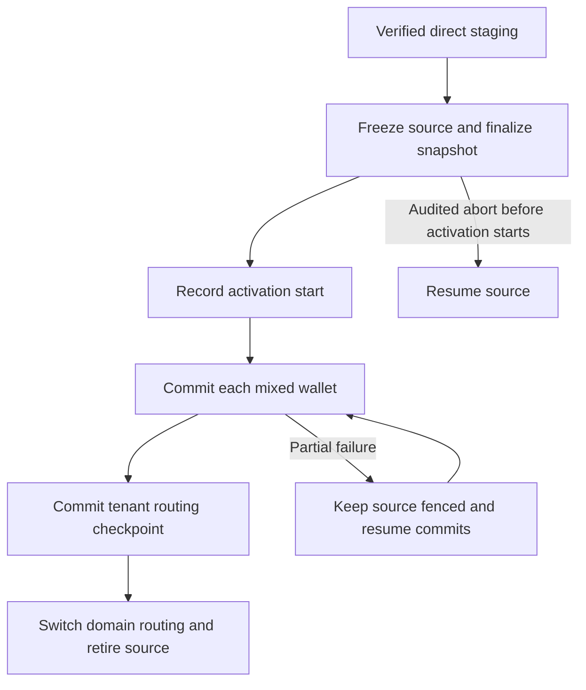

# Refactor 122B: Direct Deployment Migration

Created: September 7, 2026

Last reconciled: September 7, 2026 (embedded registration, explicit cross-app
identity input through exact wallet-ID lookup)

Status: proposed. This plan makes direct backend transfer the default experience
for cooperative migration. R122's curve-specific handoff and independent-root
wallet lifecycle proofs remain prerequisites for transferring real wallets.
No deployment, DNS integration, or direct-transfer implementation is claimed.

## Outcome

A tenant moves its wallet service from managed Seams to customer-owned
infrastructure through one guided flow:

```text
Connect infrastructure -> Deploy -> Verify destination -> Review -> Migrate
```

Wallet addresses, supported owner access, profiles, and application settings
follow the tenant. The system generates configuration and transfers encrypted
material directly between backends. The tenant handles no migration archive
or internal Worker environment matrix in the normal flow.

Direct delivery reduces operator handling and allows temporary import keys.
Its security still depends on correct authorization, destination-key binding,
role isolation, and the R122 handoff protocol. Domain ownership alone grants no
wallet export or activation authority.

## Ownership and scope

| Authority | Owns |
| --- | --- |
| [R122](./refactor-122-deployment-portability.md) | Portable wallet payload, curve capsules, identity mapping, importer, continuity proofs, source fence, activation, retirement, and backup recovery |
| R122B | Tenant RP hostname onboarding, ROR enrollment, guided bootstrap, domain/key enrollment, direct encrypted delivery, profile/asset migration integration, progress, and cutover UX |
| [R120](./refactor-120-rotate-tenant-secrets.md) | Independent tenant roots, distributed creation, role-local custody, and deployment security profiles |
| [R121](./refactor-121-tenant-derivation-root-security.md) | Exact-root disaster recovery and separate A/B recovery custody |
| [Wallet domain plan](./saas/self-hosted-migration.md) | Stable browser origin, RP ID, and routing continuity |

R122B implements the guided surface over R122's deployment compiler and import
contracts. There is one compiler, one domain payload, and one wallet importer.
The temporary direct-transfer envelope and durable backup envelope are distinct
delivery boundaries that normalize into the same verified import records.

The first target is managed Seams to an empty customer-owned Cloudflare
deployment. An existing empty deployment may enroll through the same verified
destination contract. Import into a populated deployment, other cloud providers,
automatic failover, and managed standby signing remain outside this release.

R122's backup-first release gate remains: prove source-independent restore
before shipping migration. Development of guided bootstrap and destination
verification may proceed independently of unfinished wallet handoff work.

## Hosted onboarding and tenant RP identity

New tenants start on managed Seams without owning a domain, connecting a cloud
account, or deploying infrastructure. At signup they reserve a readable slug:

```text
Application:          Pokopia
Application website: https://pokopia.com
Wallet application:  https://sign.seams.sh
Passkey RP ID:       pokopia.sign.seams.sh
ROR document:        https://pokopia.sign.seams.sh/.well-known/webauthn
```

Use the recognizable app slug because authenticators may display the RP ID.
Authorization and persistence still resolve the immutable internal tenant ID.
The slug is a permanent public credential namespace, never an authorization
claim. A friendly name does not establish ownership of a similarly named domain.
Verify domain control before presenting that association as verified.

Normalize and validate slugs once at reservation: lowercase ASCII letters,
digits, and interior hyphens, within a single DNS label. Enforce uniqueness and
reserve Seams operational names. The slug becomes immutable when the first
credential is registered; serialize that transition with slug changes so a
concurrent registration cannot use a released hostname. Never reassign any
previously allocated RP hostname, including after tenant deletion. App names
and branding may change independently. Changing an established RP ID requires
explicit owner credential enrollment or a supported recovery flow.

## Shared wallet application and ROR hosting

Keep `https://sign.seams.sh` as the shared wallet iframe origin. Apps embed the
same wallet surface so an owner can connect an existing wallet to another app.
Tenant-specific wallet application origins would require additional discovery
and routing; they remain a possible supported-client ceremony path, rather than
the default product experience. One shared deployment could serve those origins
if needed. The shared-origin choice is driven by interoperability.

Initially the tenant's JSON document contains:

```json
{
  "origins": ["https://sign.seams.sh"]
}
```

Serve `application/json` over HTTPS at the exact well-known path. Wildcard DNS
and TLS coverage for `*.sign.seams.sh` can route tenant hostnames to one shared
service. Resolve the tenant from the validated request hostname; unknown or
unallocated hosts fail closed. Cache keys include the hostname, and updates
must follow a defined cache freshness policy. The existing `sign.seams.sh`
application needs its own appropriate route and TLS coverage.

The shared service reads a durable, tenant-scoped ROR registry. Each allocated
RP hostname maps to one immutable tenant ID and that tenant's approved exact
origins. N tenants require N registry entries served by one deployment. Hosted
and migrated tenants use the same service; its lifecycle is independent of the
managed wallet backend.

```text
pokopia.sign.seams.sh/.well-known/webauthn
  -> validated hostname
  -> immutable Pokopia tenant ID
  -> active approved origins for Pokopia
  -> JSON document
```

Provision `https://sign.seams.sh` as a Seams-owned origin when creating the
tenant RP record. Customer origins enter the registry only after all three
checks succeed for the same tenant and destination:

- fresh authenticated tenant-admin approval of the exact origin;
- a fresh DNS TXT challenge bound to the tenant and destination descriptor;
- destination enrollment, including possession of its approved import key.

Persist the authorization, verification evidence, and active origin together
through the existing operation/state patterns. An origin verified for tenant A
cannot be added to tenant B's document using that evidence. The read endpoint
returns active approved records; it accepts no requested-origin override and
does not perform a new DNS challenge on each browser fetch.

DNS verification establishes domain control during initial destination enrollment.
After migration, the tenant assumes responsibility for continued domain control,
delegation updates, and removal when relinquishing a domain. Seams retains the
tenant-approved delegation without guaranteeing continuous domain revalidation.
Optional revalidation may inform administration; it is outside the required
migration path. A retained entry records approval and enrollment-time verification,
and makes no claim of current domain ownership. Removing the temporary TXT
challenge does not revoke that delegation. Keep an authenticated update/removal
path and invalidate service caches within the stated freshness policy; browser
caches may delay effective removal. Only authorized tenant administration or
Seams security administration may mutate this state. The durable delegation
outlives temporary import keys and their possession proofs.

Each tenant hostname needs only this ROR endpoint for the ROR operating path.
There is no separate SDK build, Worker deployment, database, or full wallet
application per tenant. If supported-browser requirements call for a ceremony
at the tenant origin, one shared application deployment can serve those
hostnames too; that path must be explicitly specified and demonstrated.



Credential creation and authentication explicitly use the full tenant RP ID.
The server resolves it from trusted configuration for the tenant operating the
selected wallet and verifies the expected credential, RP ID, and calling origin.
The embedding app's tenant does not override an existing wallet's RP ID or
custody backend. Never default registration to `sign.seams.sh` or trust an
unvalidated caller-selected tenant/RP combination.

ROR checks the origin executing WebAuthn, which here is the iframe. Embedding
sites do not each need a ROR entry. They still require the correct WebAuthn
Permissions Policy delegation, required user activation, and Seams' explicit
app-origin and message authorization. “Any embedding site” means any supported,
authorized integration. See [WebAuthn iframe and ROR rules](https://www.w3.org/TR/webauthn-3/#sctn-related-origins).

Each RP hostname has its own bounded origin list, avoiding one fleet-wide list
of unrelated customer domains. Browser label limits still apply per document.
The service must not personalize responses by referrer, cookies, or inferred
caller: ROR fetches omit credentials and referrers. Hostname-based routing is
sufficient. See [ROR validation](https://www.w3.org/TR/webauthn-3/#sctn-validating-relation-origin).

Tenant RP IDs separate credential namespaces. The shared `sign.seams.sh`
JavaScript and browser storage remain a common trust boundary; ROR does not
create per-tenant frontend isolation. Keep tenant-scoped authorization and
custody access checks in that shared application.

## Cross-app wallet ownership and passkey discovery

Distinguish the tenant operating a wallet from apps the owner authorizes to
connect to it. Connecting a Pokopia wallet to app B preserves that wallet's
identity, RP ID, and custody operator. App B's connection grants no authority
to include the wallet's custody material in app B's tenant migration. Migration
inventory follows custody ownership; app-owned profiles and connection records
follow their existing authorization and data-ownership boundaries.

```text
App B embeds sign.seams.sh
  -> owner selects an existing Pokopia wallet
  -> resolve its RP ID and current custody backend
  -> request its passkey using rpId = pokopia.sign.seams.sh
  -> owner approves App B's connection
```

WebAuthn discovery operates within one requested RP ID. In the shared iframe,
`navigator.credentials.get()` with `rpId: "pokopia.sign.seams.sh"` and an omitted
or empty `allowCredentials` can offer available discoverable Pokopia credentials
when ROR authorizes `https://sign.seams.sh` and the client supports the flow.
Touch ID performs local user verification; it does not broaden RP selection.
Requesting `rpId: "sign.seams.sh"`, another tenant's RP ID, or omitting `rpId`
does not discover Pokopia credentials. There is no wildcard RP ID or combined
all-tenant passkey picker. A nonempty `allowCredentials` further filters the
credentials within the requested RP. See [WebAuthn discovery](https://www.w3.org/TR/webauthn-3/#dom-publickeycredentialrequestoptions-allowcredentials).

The shared wallet selector must resolve a wallet or its RP namespace before
starting authentication when the RP ID is unknown. A trusted explicit RP ID
skips that selection: the browser offers discoverable credentials within that
RP. The SDK's `iframeWallet.rpIdOverride` passes the configured RP ID through to
WebAuthn, including child and unrelated domains; the browser enforces ordinary
domain eligibility or ROR. It must never silently replace an explicit RP ID
with the iframe hostname. This plumbing does not implement ROR provisioning or
authorize arbitrary tenant/RP combinations. Define a remembered-wallet path and an explicit
exact wallet-ID lookup path for a fresh browser or unavailable remembered state.
Treat lookup results as routing hints until authentication succeeds; discovering
a wallet grants no app access. Reuse existing account discovery where suitable.
Do not promise automatic cross-app session recognition from the common iframe
origin alone. Post-migration routing must resolve the wallet's current operator
without keeping the source signing backend alive; the exact connection flow to
the tenant-hosted wallet remains a design decision.

### Exact wallet-ID lookup across apps

Registration stays entirely embedded, with no required popup or top-level visit
to `sign.seams.sh`.
When no usable remembered identity exists, passkey-only owners supply a wallet
ID, for example `jade-lake-9123`. Resolve the RP ID before requesting the
passkey, then remember the authenticated wallet in the current storage partition.
The wallet ID grants no authentication or signing authority. The first release
uses an exact-key lookup through existing wallet persistence: no prefix search,
autosuggest, username search, app search, or separate search index.

The baseline cross-app connection flow is:

1. App B embeds the shared wallet and offers any locally remembered wallets.
2. If the desired wallet is unknown, the owner enters the complete wallet ID
   and submits it. An unmatched ID shows a correction/retry message.
3. The wallet resolves that exact ID through the wallet service to obtain
   the registered RP ID and current custody routing, then requests the passkey
   for that RP. App B's tenant configuration does not replace that RP ID.
4. The owner authenticates and approves App B's connection. The wallet obtains
   the authorized state needed for use and remembers the identity in App B's
   storage partition for subsequent visits.

This flow requires no registration popup, shared browser database, or open App A
tab. Required custody state must be retrievable through the authorized wallet
service or an explicit supported recovery path. An identity hint alone cannot
restore material held only in App A's local storage. Storage clearing or a new
browser can require identity input again.

## Passkey continuity during migration

After fresh tenant approval and verification of the exact destination wallet
origin, publish a tenant-specific ROR update such as:

```json
{
  "origins": [
    "https://sign.seams.sh",
    "https://wallet.pokopia.com"
  ]
}
```

Origins include the scheme and exact host. List `https://pokopia.com` only if
WebAuthn runs there. DNS TXT verification establishes control of the destination;
the authenticated tenant's migration approval authorizes adding it to this
tenant's ROR document. DNS verification alone never grants RP delegation.

The destination uses `rpId = pokopia.sign.seams.sh` for existing credentials
and verifies its own wallet origin. Owners can return later and use those
passkeys without first visiting the old wallet UI or enrolling a replacement,
provided the supported ROR and custody path remains available. Optional new
passkeys under a customer-owned RP ID require an owner-authorized credential
and custody-binding transition; they can gradually remove the Seams dependency.

ROR changes access to the credential namespace and grants no migration-only or
per-wallet restriction. Treat each allowed origin as trusted to request that
tenant's passkeys. Publish delegation only after explicit destination approval
and readiness, record it in the migration journal, and handle removal on abort.
Removal can be delayed by client caches and cannot retract completed ceremonies.
It never replaces the source fence or destination activation checks.

Moving the iframe changes its browser storage origin. Import credential public
metadata and required owner-encrypted envelopes, then prove cold unlock from the
destination without reading old-origin IndexedDB. Test PRF support and output
continuity for the same credential and inputs, authenticated envelope bindings,
and the full promised independent-root wallet lifecycle. ROR authentication
alone is insufficient evidence of recoverable custody.

Retain each used tenant RP hostname, DNS, HTTPS, and ROR document while owners
depend on its credentials. The old wallet database and signing backend may be
retired after the destination lifecycle is proven. This is backend portability
with a retained Seams RP service dependency. An outage of that service may block
fresh ROR validation even when the customer backend and backup are available.
Seams commits to retaining the original RP endpoint and approved delegation for
as long as it operates this service, including after managed hosting ends. Never
delete the RP endpoint merely because the billing relationship has ended.
Document availability and the authenticated delegation-management path.

Migration completion and managed-account closure must preserve the tenant RP
registry entry and immutable slug reservation. Keep an authenticated management
path for migrated tenants to maintain their delegated domains independently of
retired managed-wallet sessions and billing membership. The retained entry
contains RP routing, approved origins, and authorization/audit evidence; it
requires no old signing shares or full wallet database. Back up the registry as
shared service configuration so restoring the ROR service preserves migrated
tenants too.

The tenant assumes ongoing wallet operations and owner migration after cutover:
reminding dormant owners, enrolling credentials under a tenant-controlled RP ID,
and offering supported additional factors such as Email OTP through the existing
owner-authorized factor-addition flow. Seams supplies the retained ROR bridge.
This keeps the migration window open for remaining owners while the service
operates; it does not require retaining their former wallet backend. ROR itself
continues to authorize the listed origin for the RP namespace. Any migration-only
or per-owner restrictions are enforced by the destination application.

Dormant owners need no advance enrollment at the destination when the proven
ROR path supports their existing credential. On return they authenticate at the
customer wallet origin. The customer must retain the imported credential public
metadata, required owner-encrypted envelopes, and signing material. Seams
retains the RP endpoint and authorized delegation. Continuing to serve other
tenants makes this operationally lightweight, but does not replace the explicit
retention and availability commitment for migrated tenants.

Existing credentials registered under a shared RP ID cannot acquire a
tenant-specific RP ID retroactively. Inventory them separately. Their migration
requires owner-approved new credential enrollment through the old origin while
it remains usable, or an already-supported independent recovery method. A popup,
redirect, or tested iframe bridge may perform the owner-side handoff. Keep any
bridge minimal and migration-only, with encrypted destination-bound delivery.
Freeze its retention policy and report dormant users who still depend on it;
this plan cannot promise both unconditional access and complete old-origin
retirement for owners with no other usable factor.

## Tenant experience

1. **Connect infrastructure.** Select the customer accounts and grant the
   reviewed deployment permissions. Connect the separate A/B administrative
   authorities required by the selected production profile.
2. **Deploy.** Confirm destination region/network choices supported by the
   profile, relayer configuration, domains, and recovery recipients. Show the
   resources and permissions before creating them. Generate all role bindings
   and keys through their owning components.
3. **Verify destination.** Install a fresh DNS challenge after customer approval,
   verify the destination key, and run deployment readiness checks.
4. **Review migration.** Show wallet and profile inventory, supported device
   continuity, owner actions, excluded state, backup readiness, and the exact
   destination. Unsupported required wallet behavior blocks migration.
5. **Migrate.** Transfer and stage while the source serves requests. Obtain
   fresh cutover approval, fence the source, finalize the snapshot, activate the
   destination, and switch routing through R122's lifecycle.

Use a temporary destination endpoint during preparation. A customer-owned
wallet origin may remain stable across backend cutover. For the default hosted
path, move from `sign.seams.sh` to the verified customer wallet origin while
preserving the tenant RP ID through ROR. Owners with a working old credential
can authorize new-RP enrollment directly; independent recovery is required when
that old access path is unavailable. Preview the applicable path per credential.

The UI reports the authoritative current step, completed effects, and the next
action. It exposes source availability and any owner intervention explicitly.
Fresh destination sessions and owner-approved agent authorizations remain
required. “Seamless” applies only to the capabilities proven in the preview.

## Deployment and permissions

Reuse the configuration and ownership patterns in
[deployment targets](../scripts/deployment-targets.mjs),
[backend deployment](../scripts/deploy-backend.mjs), and
[Gateway configuration](../packages/console-server-ts/scripts/gateway-deployment-config.mjs).
Support customer resources through the R122 compiler; do not fork the managed
deployment scripts into a second independently maintained workflow.

Provision Gateway, Router, Deriver A, Deriver B, SigningWorker, and the
tenant-root control-plane Worker, plus their required stores, backup providers,
creation-grant authority, identity resolver, and private transports. R120 creates
tenant-root shares inside the Derivers. The dashboard receives public evidence.

DNS approval and deployment approval are separate grants. Choose and prove one
Cloudflare account-connection mechanism before committing to a “Connect
Cloudflare” implementation. Evaluate user-approved Domain Connect for DNS and
the available OAuth or scoped-token deployment flow. Required API support,
provider registration, permission scope, expiry, and revocation remain an
integration decision. Do not assume DNS consent grants Worker deployment access.

Use the narrowest supported account/zone scope. Keep credentials out of
manifests, browser storage, logs, and portability payloads. End temporary grants
after completion or abort. Automatic DNS installation is convenience over the
tenant's delegated authority; it is not an independent second approval.

Provision operational encryption before accepting any secret material. KMS
integration may follow an explicitly supported role-local operational profile;
unprotected temporary storage is never an intermediate step. Record the R120
security profile and its erasure limitations. Shared administration or a central
bootstrap credential that can control both Derivers cannot substantiate the
independent-authority claim.

## Destination enrollment



The destination descriptor binds the migration ID, source tenant, destination
deployment and manifest digest, HTTPS import endpoint, receiving role, public
import key fingerprint, and expiry. A receiver generates its private import key
within its own boundary. Server-participant material targets the SigningWorker
import boundary; Gateway handles its own metadata and assets.

Place a fresh challenge at `_seams-migration.<customer-domain>`. Its value commits
to the descriptor and a random challenge. Verify the exact expected name and
value within the operation's validity window. Publish no private keys, wallet
inventory, or reusable bearer credentials in DNS.

Then encrypt a fresh random challenge to each receiving key and require an
operation-bound proof of decryption. Tenant approval, domain control, and key
possession are separate required evidence. Their combination verifies the
enrolled destination; it does not attest arbitrary deployed code or prove that
an account administrator is uncompromised.

Pin the approved descriptor throughout transfer. A change of endpoint, key,
role, or deployment manifest requires renewed enrollment and authorization.
Remove expired DNS challenges. Connect only to the approved public HTTPS
endpoint, reject redirects to other endpoints and private/link-local addresses,
and preserve the pinned recipient even if DNS answers change.

## Direct transfer

The source resolves one authenticated tenant and constructs R122's canonical
snapshot, manifests, and curve-specific fragments. No source tenant-root share,
deployment credential, owner plaintext, or complete wallet private key enters
this transfer.

Each source role encrypts its fragment to its enrolled destination role using
the reviewed HPKE suite. Bind migration, source tenant, wallet/key scope, curve,
role, destination descriptor, snapshot, content digest, and protocol version in
the canonical authenticated envelope. Retain source signatures and attestation
verification; transport TLS and encryption do not replace them.

The coordinator routes ciphertext and public receipts. It never decrypts
SigningWorker material. The destination verifies the source authority and exact
binding, parses the payload once, and re-encrypts material under its durable
role-local storage keys. Owner-encrypted envelopes retain their inner bytes.

Use bounded role fragments and existing durable operation journals. An exact
retry returns the saved result; changed content under an existing transfer
identity fails closed. Retain encrypted fragments only for the bounded retry
window. A durable staging receipt acknowledges validated destination storage,
not merely HTTP delivery. Lost responses resume by reading back receipts.

Temporary import keys survive only the authorized import window and are erased
after terminal completion or expiry. Expiry before completion requires new
enrollment for uncompleted delivery. Completed imports remain bound to their
original receipts and never acquire authority through a retry.

## Profiles, assets, and application state

| State | Destination behavior |
| --- | --- |
| Wallet IDs, public keys, addresses | Preserve and verify through R122 |
| Profiles, names, preferences | Parse into destination-native records with preserved wallet ownership |
| Avatars and uploaded assets | Copy authorized tenant-owned bytes, verify digest/type/size, then write destination-owned references |
| Credential metadata and owner-encrypted envelopes | Preserve required cryptographic bindings; prove supported owner access |
| Device/holder mappings | Import only pairings supported by the handoff; identify re-enrollment requirements |
| App origins and policy settings | Validate against destination configuration; require approval for authority changes |
| Agent settings | Import as inert proposals; require fresh owner authorization |
| Audit history | Preserve source provenance and checkpoint; write new destination events separately |
| Sessions, API keys, SSO membership, presignatures, replay leases | Exclude; establish destination-native state |

Source-hosted asset URLs are insufficient for independence. Export assets from
authorized source storage references; do not fetch arbitrary profile URLs as
part of migration. Inventory existing profile schemas before freezing portable
fields. Add these fields to R122's canonical payload through its normal version
boundary, so backup and direct import share their behavior.

## Activation and failure handling

Direct delivery terminates at verified staging. R122 owns every subsequent
authority transition:



Final snapshot changes invalidate earlier staging and approvals as required by
R122. Allow only the exact final-snapshot operation through the source fence.
Public destination admission requires both wallet and tenant commits. DNS
propagation cannot bypass those checks; cached source routes remain fenced.

A failed transfer leaves the source serving and the destination staged. Clean
up only resources and temporary grants owned by this attempt. Activation-start
or commit uncertainty keeps the source fenced and requires receipt readback.
After activation starts, repair forward. A failed first-owner-use canary blocks
that wallet and never reactivates the source.

## Backup remains independent

Direct migration requires an available source. Preserve R122's durable backup
path for source-unavailable recovery, encrypted to long-lived customer-controlled
recipients and preferably delivered to customer-controlled storage automatically.
Manual download remains available. Temporary transfer keys are never backup keys.

Before cutover, verify a current supported backup and its independently retained
trust/checkpoint evidence. After activation, create and verify a destination
backup. R121's root recovery packages remain separate and role-specific.
Automatic backup delivery does not grant the customer storage service plaintext
access or permission to activate a deployment.

## Implementation sequence

1. **Prove one direct handoff.** Use a pre-provisioned isolated destination,
   a mixed Ed25519/ECDSA wallet, a profile, and one owned asset. Exercise exact
   destination enrollment, source-role encryption, durable import receipts,
   and R122 continuity. Use explicit tenant-approved DNS setup for this first
   demonstration; keep provider automation out of the protocol core.
2. **Prove the complete move.** Apply the existing R122 fence and activation
   contract. Demonstrate both a stable customer origin and a shared-hosted to
   customer-origin move using the tenant RP ID and ROR. Disconnect the source
   wallet backend while retaining the ROR endpoint; exercise cold PRF unlock,
   signing, and every promised recovery/export/device operation. Finish the
   R122 capsule protocol first if this demonstration exposes a missing path.
3. **Automate deployment and domain enrollment.** Prove the selected Cloudflare
   permission flow, use the R122 compiler, and verify separate role authority,
   operational key custody, and initial deployment recovery. The same enrollment
   contract serves manual setup and provider automation.
4. **Ship the guided surface.** Add slug reservation and tenant ROR provisioning
   with fully embedded registration. Implement exact wallet-ID input and RP lookup
   for cross-app connections lacking remembered identity through existing wallet
   persistence.
   Add migration inventory preview, owner-action reporting,
   approval, resumable progress, routing, and receipt views using existing
   console/CLI patterns. Complete the independent backup release gate.

After the operating path succeeds, add focused failure coverage for wrong-tenant
approval, key substitution, expired enrollment, changed retry content, lost
staging receipts, partial activation, and asset ownership. Static fixtures must
reject mixed lifecycle branches and calls missing verified enrollment. Use
required domain fields, branch-specific builders, and one parser per external
boundary. Extend the intended-behavior contract with the shipped lifecycle.

Before enabling the hosted tenant-RP default, demonstrate creation, assertion,
PRF unlock, and iframe use across the supported browser/authenticator matrix.
Unsupported ROR clients must receive a proven tenant-origin ceremony path or
explicit unsupported-client handling; never silently register under a shared
RP ID. Validate wrong-tenant RP selection, host/cache confusion, slug reassignment,
unauthorized ROR changes, lost old-origin storage, and ROR endpoint unavailability.
Also demonstrate that tenant A's DNS evidence cannot authorize tenant B's ROR
update, ordinary ROR reads need no live DNS challenge, and a dormant owner can
unlock after migration and managed-account closure with only the retained ROR
service and destination wallet state available.

Demonstrate cross-app connection with separate iframe storage partitions and
App A closed: exact wallet-ID input resolves the original RP, passkey authentication
and connection approval succeed, and App B remembers the wallet. Repeat with
no remembered state and verify an unmatched ID can be corrected and resubmitted.

## Decisions to close before release

- Freeze the R122 capsule and exact supported destination lifecycle for each
  curve and owner-access method.
- Resolve any unspecified custody transitions at design time; demonstrate the
  specified lifecycle as an implementation acceptance criterion.
- Select the Cloudflare authorization and DNS automation integration, its scopes,
  credential custody, and cleanup behavior; prove independent A/B administration.
  Define the smallest supported deployment profile, required accounts, role
  operators, and ongoing tenant duties before promising simplified operations.
- Freeze the destination descriptor, possession proof, source trust enrollment,
  transfer envelope, expiry, and receipt encoding using existing protocol types.
- Inventory profile/asset fields and distinguish preserved cryptographic identity
  from destination-owned storage and configuration.
- Define the supported storage-key provider and separate durable backup
  recipients; qualify KMS only when its actual integration is available.
- Freeze slug validation, immutable reservation, and retired-host retention.
- Prove ROR plus PRF and embedded WebAuthn support for the release matrix; define
  the behavior for unsupported clients before making it the onboarding default.
- Define ROR update authorization, cache freshness, and
  endpoint availability after migration; separate backend independence from
  complete Seams-domain independence in product claims. Domain verification is
  required at enrollment; continued domain management belongs to the tenant.
- Specify the exact wallet-ID lookup boundary, cross-app connection authorization,
  custody-based migration inventory, and routing to migrated wallets. Keep
  exact wallet-ID input when identity is unknown and the shared
  wallet iframe as the default.
- Define migrated-tenant registry administration, retention, and backup restore
  independently of managed-wallet hosting and billing account deletion.
- Inventory shared-RP credentials and choose the owner migration bridge,
  retention policy, and retirement eligibility for those existing users.

## Completion

A tenant completes the guided migration without downloading or uploading an
archive, editing role configuration, or exposing private material to the
dashboard. New tenants onboard with a readable tenant RP hostname and no custom
domain or cloud deployment. Supported wallets retain their identities and remain
usable with the source wallet backend disconnected, with the retained ROR service
dependency stated explicitly. Profiles and assets resolve from the destination,
old source routes cannot sign, retries preserve exact receipts, and an
independent customer-held backup remains restorable.

Owner registration remains fully embedded. Cross-app connections work through
explicit wallet identity input when local recognition is unavailable, with no
dependency on shared IndexedDB or an open source app.
